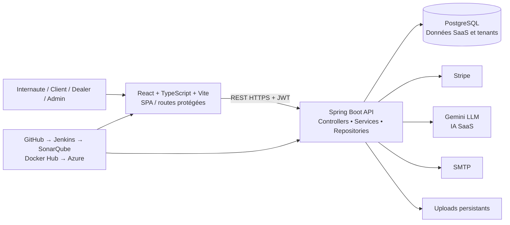
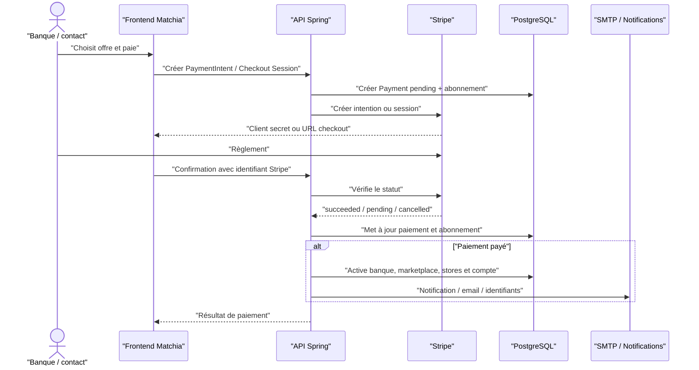
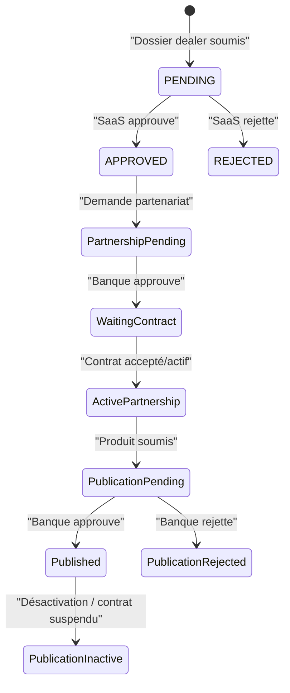
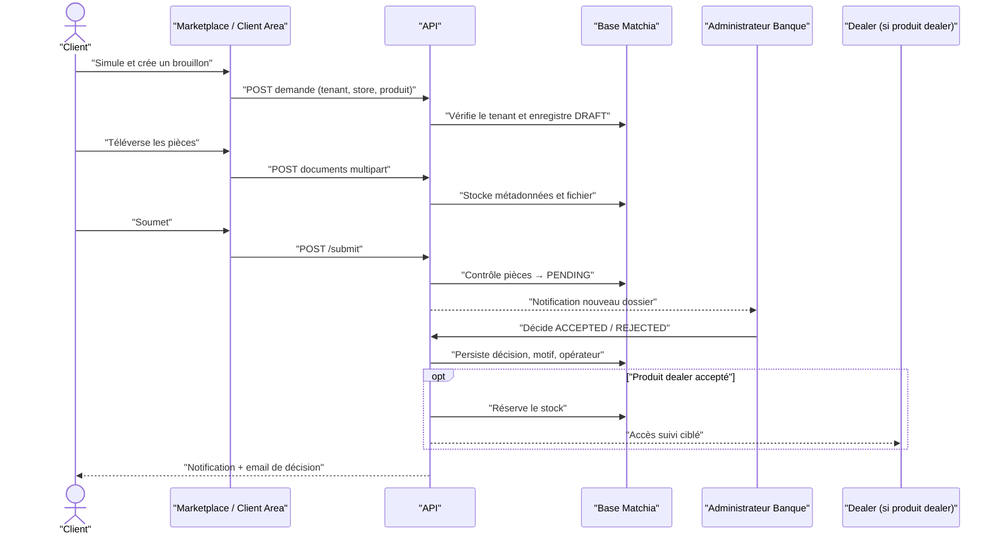
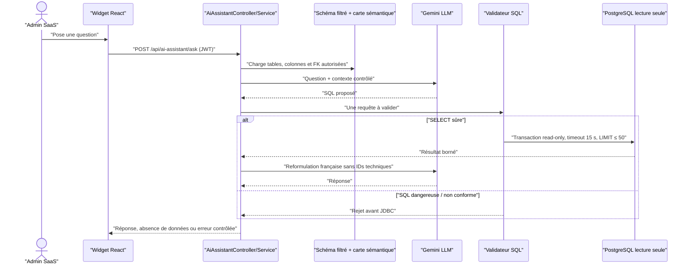
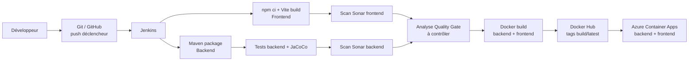

# Plan détaillé du mémoire PFE — Matchia

> **Positionnement retenu :** Matchia est une plateforme SaaS bancaire multi-tenant qui permet à plusieurs banques de disposer chacune d'une marketplace personnalisée, composée de stores et de modules activables. Elle relie aussi les banques, les concessionnaires et les clients autour de la publication de produits et du traitement de demandes de financement. Le périmètre comprend la gestion des abonnements et paiements, un assistant IA contrôlé de type Text-to-SQL, la sécurité JWT, des notifications et emails, ainsi qu'une chaîne DevOps vers Azure.

Ce document est un squelette de rédaction : chaque puce représente un contenu à développer et non un simple intitulé de table des matières.

## 0. Base factuelle de l'analyse

L'analyse a été réalisée à partir du code et de la configuration présents dans le dépôt. Les éléments particulièrement structurants sont :

- SPA **React 18 / TypeScript / Vite**, avec routage séparé SaaS et tenant, composants d'interface Radix/MUI et tests Vitest ;
- API **Spring Boot 4 / Java 17**, en couches `controller → service → repository → PostgreSQL`, avec JPA, validation, DTO/Mapper et Spring Security ;
- persistance PostgreSQL autour d'environ trente agrégats : banque, marketplace, store, module, abonnement, paiement, demandes, utilisateurs, audit, concessionnaire, produit, partenariat, contrat et financement ;
- paiement **Stripe** (Payment Intent et Checkout Session), messagerie SMTP, gestion de fichiers multipart et assistant **Gemini** contrôlé ;
- images Docker frontend/backend, Docker Compose, Jenkins, JaCoCo, SonarQube, Docker Hub et Azure Container Apps.

### 0.1 Sources de preuve à citer dans le mémoire

| Sujet | Éléments du projet à exploiter comme preuve | Usage recommandé dans le rapport |
|---|---|---|
| Navigation et espaces | `MatchiaFrontend/src/routes.tsx` | Cartographie des acteurs, captures et cas d'utilisation |
| Sécurité | `MatchiaBackend/.../config/SecurityConfig.java`, filtres JWT | Authentification stateless, contrôle d'accès, CORS |
| Multi-tenancy | `Marketplace`, `MarketplaceStore`, `MarketplaceStoreModule`, `TenantUrlSync.tsx`, `useBankTenant.ts` | Diagramme de contexte tenant et explication de l'isolation logique |
| Paiement et abonnements | `PaymentService`, `SubscriptionService`, `PaymentController` | Séquence Stripe, activation et renouvellement |
| Financement | `FinancingRequestService`, entités `FinancingRequest*` | Workflow client–banque–concessionnaire |
| Concessionnaires | `docs/dealer-management.md`, services `Dealer*`, `PartnershipContractService` | Cas d'utilisation détaillé et cycle de vie partenaire |
| Assistant IA | `docs/ai-readonly-database.md`, package `ai` | Séquence LLM et contrôles Text-to-SQL |
| Qualité et déploiement | `Jenkinsfile`, `docker-compose*.yml`, Dockerfiles, tests | Chaîne CI/CD et diagramme de déploiement |

### 0.2 Règle académique importante

Employer la formule « implémenté dans le prototype » uniquement pour les capacités effectivement présentes. Par exemple, le `Jenkinsfile` lance build, tests, scans Sonar et déploiements Azure ; il **ne contient pas d'étape explicite** `waitForQualityGate`. Le Quality Gate doit donc être présenté comme résultat de l'analyse SonarQube et comme verrou recommandé à renforcer, non comme une étape automatisée déjà codée.

De même, les secrets visibles dans la configuration locale ne doivent jamais être reproduits dans le mémoire ou les annexes ; ne documenter que le principe de variables d'environnement et de coffre à secrets.

---

# Partie préliminaire

## Pages liminaires

- Page de garde selon le modèle de l'établissement ; titre suggéré : **« Conception et réalisation de Matchia, une plateforme SaaS multi-tenant de marketplaces bancaires intégrant financement, partenariats et assistant IA sécurisé »**.
- Dédicace, remerciements, résumé français, abstract anglais, mots-clés, listes des acronymes, figures, tableaux et annexes.
- Acronymes utiles : SaaS, API, JWT, RBAC, LLM, CI/CD, ORM, UML, KPI, CRUD, SPA, SMTP, QA.
- Ajouter une courte note de périmètre : marketplace bancaire, produits bancaires et produits de concessionnaires, sans assimilation à une décision de crédit automatisée.

## Répartition retenue : six chapitres équilibrés

| Chapitre | Poids indicatif | Blocs couverts |
|---|---:|---|
| 1. Contexte et pilotage | 10–15 % | Organisme, existant, problématique, objectifs et méthode Agile |
| 2. Analyse et spécification | 18–22 % | Acteurs, besoins, backlog, règles métier et cas d'utilisation |
| 3. Architecture et conception | 18–22 % | Multi-tenancy, données, API, sécurité et UML de conception |
| 4. Réalisation du SaaS commercial | 16–20 % | Onboarding, marketplace, catalogue, abonnements et paiement |
| 5. Réalisation des parcours métier intelligents | 16–20 % | Dealer, contrats, financement client, notifications et IA |
| 6. Qualité, déploiement et bilan | 14–18 % | Tests, CI/CD, Docker/Azure, validation, conclusion et perspectives |

Cette répartition évite deux déséquilibres fréquents : un chapitre « réalisation » trop massif, et une partie DevOps réduite à quelques pages malgré l'existence d'un pipeline complet.

# Chapitre 1 — Cadre général, contexte et étude de l'existant

**Objectif :** établir le problème métier, le besoin d'une plateforme mutualisée et la pertinence de Matchia avant toute description technique.

## 1.1 Présentation de l'organisme d'accueil et cadre du PFE

- Présenter l'organisme, son domaine, son organisation et le rattachement de la mission. Utiliser uniquement les informations institutionnelles validées par l'encadrant.
- Décrire la place du projet : digitalisation de l'offre bancaire, mise en relation avec l'écosystème de distribution et amélioration de l'expérience de souscription.
- Préciser les contraintes du sujet : diversité des banques, personnalisation d'identité, contrôle des accès, traçabilité et sécurité de données personnelles.

## 1.2 Contexte général

- Expliquer la fragmentation usuelle : les banques doivent gérer une présence digitale, des catégories d'offres, des partenaires concessionnaires, des prospects et des dossiers de financement.
- Mettre en évidence le coût et la lenteur d'une plateforme spécifique par banque ; introduire le SaaS comme mutualisation de l'infrastructure et différenciation par configuration.
- Positionner Matchia comme plateforme opérateur : le SaaS gouverne les tenants ; chaque banque exploite sa marketplace ; les clients consultent et déposent des demandes ; les concessionnaires alimentent des offres sous validation bancaire.

## 1.3 Étude de l'existant et critique

Organiser la comparaison par problèmes, pas par produits commerciaux nommés sans source :

- site bancaire institutionnel : consultation statique, faible configurabilité des catégories et absence de workflow partenaire intégré ;
- développement isolé par banque : redondance, coûts de maintenance et mises à jour hétérogènes ;
- traitement dispersé des demandes : pièces jointes, décisions, communications et suivi non centralisés ;
- simple catalogue produit : pas de contrats banque–concessionnaire ni de validation de publication ;
- chatbot généraliste : incapable de garantir une consultation SQL contrôlée des données internes.

Conclure avec le tableau « Limite observée → réponse Matchia → valeur produite ». Faire ressortir : multi-tenancy, paramétrage stores/modules, traçabilité, contrôle métier des transitions et automatisation des communications.

## 1.4 Problématique, objectifs et périmètre

**Problématique proposée :** comment concevoir une plateforme SaaS multi-tenant qui permette à chaque banque de déployer une marketplace personnalisée et modulaire, tout en sécurisant les processus d'abonnement, de partenariat, de publication et de financement impliquant plusieurs acteurs ?

- Objectif général : réaliser une plateforme centralisée, configurable et sécurisée.
- Objectifs spécifiques : onboarding banque, création de marketplace, gestion de catalogue, contrats partenaires, espace client, dossiers de financement, paiement/abonnement, IA analytique contrôlée, industrialisation DevOps.
- Hors périmètre à annoncer clairement : décision de crédit autonome, KYC réglementaire complet, paiement de production sans paramétrage de secrets, multi-région et haute disponibilité certifiée.

## 1.5 Méthodologie et organisation agile

- Justifier Scrum ou une démarche agile adaptée : livraisons incrémentales, démonstrations des parcours et répriorisation des besoins.
- Présenter les artefacts : product backlog, sprint backlog, user stories, critères d'acceptation, revue, rétrospective et versioning Git.
- Inclure le chronogramme des releases de la section 1.6 ; l'adapter aux dates réelles du stage.

**Diagrammes / figures :** diagramme de contexte métier (figure 1.1), schéma de problématique, tableau comparatif de l'existant, macro-planning.

**Captures à prévoir :** page d'accueil Matchia, page publique des banques et exemple de marketplace personnalisée.

## 1.6 Planification Agile par releases et sprints

La planification suivante est cohérente avec les dépendances visibles dans le code. Ajuster la durée (souvent deux semaines) aux dates réelles et ne pas prétendre rétrospectivement qu'elle a été suivie à l'identique si ce n'est pas le cas.

| Release / sprints | Objectif | User stories et fonctionnalités | Acteurs / livrables | Dépendances |
|---|---|---|---|---|
| **R1 — S1–S2 : socle** | Sécuriser les fondations. | Modèle Bank/User, authentification JWT/refresh, rôles, profil, routes protégées, PostgreSQL, CRUD de base stores/modules. | SaaS, banque ; API auth, SPA et schéma initial. | Aucune |
| **R2 — S3–S4 : SaaS multi-tenant** | Créer et administrer les tenants. | Demande banque, vérification email, validation/rejet, marketplace, slug, branding, stores/modules par tenant, contenu. | Public, SaaS, banque ; onboarding et marketplace configurée. | R1 |
| **R3 — S5 : expérience marketplace** | Rendre la marketplace commercialisable. | Accueil tenant, stores, produits bancaires, paramètres, bannières, comparateur, simulateur, blog. | Internaute, client, banque ; parcours de consultation. | R2 |
| **R4 — S6 : abonnement/paiement** | Monétiser et activer les services. | Demandes souscription, Stripe intent/session, paiement, activation, notifications, emails, renouvellement/échéance, revenu. | SaaS, contact banque, Stripe ; cycle commercial complet. | R2 |
| **R5 — S7–S8 : concessionnaires** | Intégrer l'écosystème B2B. | Demande dealer, approbation, profil, partenariat, contrat, produit, stock, documents, publication multi-banque. | SaaS, banque, dealer ; chaîne B2B. | R2, R3 |
| **R6 — S9 : financement client** | Transformer la conversion en dossier suivi. | Inscription client tenant, profil, brouillon, simulation, exigences, upload, soumission, traitement banque, accès dealer, réservations. | Client, banque, dealer ; workflow financement. | R3, R5 |
| **R7 — S10 : IA et traçabilité** | Offrir une analyse sûre. | Audit, dashboards, widget IA, intention/carte sémantique, SQL allowlist et lecture seule. | SaaS ; assistant vérifié. | R1–R6 |
| **R8 — S11–S12 : qualité et livraison** | Stabiliser et déployer. | Tests, JaCoCo/Vitest, Sonar, Docker/Compose, Jenkins, Docker Hub, Azure, recette. | Équipe technique ; pipeline et guide exploitation. | Toutes releases |

Pour chaque sprint effectivement réalisé, ajouter : sprint goal, backlog sélectionné, burndown ou tableau d'avancement, démonstration, tests exécutés, obstacles et décision de rétrospective.

---

# Chapitre 2 — Analyse et spécification des besoins

**Objectif :** transformer la problématique en exigences vérifiables, identifier précisément les acteurs et démontrer que la plateforme dépasse un CRUD isolé.

## 2.1 Identification des acteurs et responsabilités

| Acteur | Rôle et périmètre | Actions majeures / restrictions |
|---|---|---|
| **Administrateur SaaS** | Opérateur global de Matchia ; vision transverse sur la plateforme et les tenants. | Gère banques, demandes d'adhésion, marketplaces, stores, modules, utilisateurs, contenu global, abonnements/paiements, audit et demandes concessionnaires. Il ne se comporte pas comme administrateur opérationnel d'une banque. |
| **Administrateur Banque** | Administrateur d'un tenant bancaire. | Configure seulement sa banque/marketplace : utilisateurs de sa banque, stores et modules souscrits, branding, contenu, produits, concessionnaires, contrats, demandes de financement, profil et abonnement. Les services vérifient l'appartenance au tenant. |
| **Concessionnaire / Dealer admin** | Partenaire commercial rattaché à une catégorie (store), potentiellement à plusieurs banques. | Soumet son dossier, gère son profil, demande/négocie les partenariats, crée ses produits, stock, paramètres et documents, puis demande la publication. Ne peut publier directement ni traiter le dossier bancaire. |
| **Client** | Utilisateur inscrit dans une marketplace bancaire donnée. | Gère profil, consulte ses KPI et ses demandes, calcule une simulation, crée un brouillon, téléverse/supprime les pièces avant soumission, suit la décision et lit ses notifications. Il ne peut consulter les données d'un autre client/tenant. |
| **Internaute** | Visiteur non authentifié. | Consulte les banques, concessionnaires, marketplaces et produits publics ; dépose une demande banque ou concessionnaire ; crée un compte client ; initie une récupération de mot de passe. Accès limité aux APIs publiques. |
| **Prestataire Stripe** | Système externe de paiement. | Reçoit les données de session/paiement, retourne un statut ; Matchia conserve la logique d'activation après confirmation. |
| **Gemini / LLM** | Service d'IA externe. | Produit une requête SQL et une reformulation, sans connexion à la base. Accessible seulement via le backend pour l'administrateur SaaS. |
| **Service SMTP** | Infrastructure d'envoi. | Diffuse les emails de vérification, confirmation, identifiants, paiement, renouvellement, rejet et décision de financement. |
| **Jenkins, SonarQube, Docker Hub, Azure** | Chaîne technique. | Automatisent intégration, analyse, construction, registry et livraison des deux conteneurs. |

### Matrice synthétique des droits

| Domaine | SaaS | Banque | Dealer | Client | Public |
|---|---:|---:|---:|---:|---:|
| Banques, stores, modules globaux | CRUD | Lecture / sélection souscrite | Lecture ciblée | Lecture publique | Lecture publique |
| Marketplace et branding | CRUD transverse | Configuration de son tenant | Non | Consultation | Consultation |
| Utilisateurs | CRUD / activation | CRUD de son périmètre | Profil propre | Profil propre | Inscription |
| Produits banque | Supervision | CRUD propre | Non | Lecture | Lecture |
| Produits dealer | Supervision | Validation de publication | CRUD propre | Lecture si publié | Lecture si publié |
| Partenariats et contrats | Consultation / contrôle | Proposition, validation, contrat | Demande, acceptation, produits | Non | Non |
| Financement | Supervision éventuelle/audit | Traitement de son tenant | Consultation liée à ses produits | CRUD de son dossier | Non |
| Abonnement/paiement | Pilotage et statistiques | Consultation/demande selon écran | Non | Non | Paiement du lien autorisé |
| Assistant IA analytique | Oui | Non | Non | Non | Non |

## 2.2 Besoins fonctionnels par sous-système

### A. Socle d'identité et sécurité

- connexion, JWT d'accès court et refresh token en cookie ; récupération et réinitialisation de mot de passe ; déconnexion ; consultation de session `me` ;
- rôles implémentés : `ADMIN_SAAS`, `ADMIN_BANK`, `DEALER_ADMIN`, `CLIENT` ; statuts utilisateurs ;
- inscription client attachée à une banque/marketplace, vérification d'email pour une demande d'adhésion bancaire ;
- profil, coordonnées et image de contact ; protection des routes React et contrôle backend.

### B. Gouvernance SaaS et onboarding des banques

- dépôt d'une demande d'adhésion bancaire, avec contact, coordonnées, identité visuelle, pays, site, présentation et sélections d'offres ;
- sélection de stores et modules, calcul du total ; statut de demande, validation/rejet motivé, notifications et email ;
- création/gestion de banques, marketplace, utilisateurs SaaS/bancaires et demandes ;
- tableaux de bord, métriques de paiements, abonnements payés et alertes d'échéance ;
- journal d'audit consultable, statistiques et export.

### C. Marketplace, catalogue et modularité

- marketplace par banque : slug, couleurs, logo, bannière, titre, texte d'accueil, pied de page et statut ;
- catalogue de stores administré au niveau SaaS, prix/statut/icône/bannière et compteur d'usage ;
- association `MarketplaceStore` : activation, visibilité, banner unique ou galerie de bannières ordonnée ;
- modules globaux et association au store : activation, visibilité, ordre, prix et paramètres configurables ;
- contenu global par store et contenu spécifique marketplace, avec visibilité et statut ;
- produits bancaires, image, prix, valeurs des paramètres définis par store.

### D. Parcours marché et outils de conversion

- accueil de marketplace tenant-aware, navigation par store, contenus, bannières et produits publics ;
- modules disponibles selon le paramétrage : simulateur, comparateur, blog ;
- simulateur utilisant durée, apport, montant, taux et mensualité, dont les données sont mémorisées dans la demande de financement ;
- comparateur de produits à paramètres variables, utile lorsque les stores proposent des caractéristiques hétérogènes.

### E. Cycle concessionnaire, partenariat et publication

- demande de création de compte multipart (données, logo, justificatifs), consultation sécurisée des pièces par SaaS, approbation/rejet et création de l'administrateur ;
- recherche des banques accessibles par catégorie, création de partenariat unique `dealer–bank–store`, suivi des demandes envoyées/reçues/actives ;
- états : attente, approuvé, attente de contrat, actif, rejeté, suspendu, terminé ;
- contrat : brouillon, envoi à acceptation, activation, expiration/terminaison ; modalités, commission et conditions ;
- produits dealer : brouillon/actif/inactif, stock total/disponible/réservé, prix, image, éligibilité, paramètres et documents publics/privés ;
- demande de publication par banque et store, approbation/rejet/inactivation ; une publication est isolée par banque et ne devient publique que si toutes les conditions sont actives.

### F. Financement et espace client

- tableau de bord client, profil, demandes et centre de notifications ;
- création brouillon contrôlée par le tenant, store actif et produit cohérent ; produit bancaire ou produit dealer déjà publié ;
- exigences de documents par banque/store (avec socle par défaut), upload limité, remplacement/suppression avant soumission, téléchargement autorisé selon le rôle ;
- soumission seulement si documents requis présents ; traitement banque `PENDING → ACCEPTED|REJECTED`, motif obligatoire en cas de rejet, commentaire, date et opérateur de traitement ;
- écran banque avec filtres store, statut, recherche ; accès concessionnaire restreint aux demandes concernant ses produits ; réservation de stock lors de l'acceptation.

### G. Notifications, emails et audit

- notifications persistées, non lues/lues, marquage unitaire/global et suppression ; destinataires SaaS, banque, dealer, client ;
- emails : code de vérification, confirmation/rejet d'adhésion, identifiants, lien de paiement, rappel d'échéance, partenariat/contrat, publication, réinitialisation et décision financement ;
- audit asynchrone : acteur, tenant, action, catégorie, ressource, statut, IP, user-agent, corrélation, banque/marketplace et destinataire.

### H. Abonnement et paiement

- abonnement d'une durée de douze mois, états `PENDING_PAYMENT`, `ACTIVE`, `EXPIRED`, `PENDING_RENEWAL` ;
- création Payment Intent ou Checkout Session Stripe, mémorisation de l'identifiant Stripe, lien, devise, montant, type initial/renouvellement et statut ;
- confirmation de paiement, activation banque/marketplace/compte lorsque la demande d'adhésion est payée, activation de store si concerné, émission des identifiants ;
- rappel de fin de souscription, demande de renouvellement, lien de paiement de renouvellement et statistiques mensuelles.

### I. Assistant IA contrôlé

- widget réservé à l'administrateur SaaS ; question en français ; analyse d'intention et carte sémantique ;
- lecture dynamique du schéma filtré, génération SQL par Gemini, validation stricte, exécution transactionnelle en lecture seule et réponse française ;
- tentatives alternatives en cas de requête vide/erronée, résultat limité à 50 lignes, gestion des messages « aucune donnée », requête refusée ou erreur.

## 2.3 Besoins non fonctionnels

- **Sécurité :** JWT stateless, mots de passe hashés, expiration, refresh token, RBAC, CORS, validation d'entrées, contrôles d'appartenance tenant dans les services, fichiers privés servis par endpoints authentifiés.
- **Confidentialité :** le client ne voit que ses demandes, la banque son tenant, le dealer ses produits et demandes associées ; l'IA filtre les champs sensibles.
- **Intégrité :** contraintes d'unicité sur partenariat et publication, transitions d'état contrôlées, version optimiste sur une demande de financement, transactionnalité JPA.
- **Performance :** API REST, pagination/filtres dans les écrans de gestion, index tenant/store et client des demandes ; limite IA de 50 lignes et timeout 15 s.
- **Maintenabilité :** séparation controller/service/repository, DTO/mappers, TypeScript, tests et analyse Sonar.
- **Déployabilité :** conteneurs indépendants, variables d'environnement, volumes pour fichiers, réseau Docker et Azure Container Apps.

## 2.4 Backlog produit et critères d'acceptation

Présenter le backlog complet en annexe, puis une sélection dans le chapitre. Exemple de formulation :

| Epic | User story représentative | Critère d'acceptation vérifiable |
|---|---|---|
| Tenant | En tant qu'admin banque, je configure ma marketplace afin d'exprimer mon identité. | Les couleurs, logo, bannière et contenu se reflètent seulement sur le tenant visé. |
| Partenariat | En tant que dealer, je demande un partenariat à une banque pour un store. | Le doublon dealer–banque–store est refusé et la banque destinataire est notifiée. |
| Financement | En tant que client, je soumets un dossier complet. | La soumission échoue lorsque toute pièce obligatoire active manque. |
| Paiement | En tant que banque, je règle mon abonnement pour activer ma marketplace. | À la confirmation payée, abonnement, banque, marketplace et compte concernés deviennent actifs. |
| IA | En tant qu'admin SaaS, je pose une question sur les données opérationnelles. | Une requête non-SELECT, sensible ou >50 lignes est rejetée avant JDBC. |

**Diagrammes UML à intégrer :**

1. Diagramme de contexte : tous les acteurs, Matchia, Stripe, Gemini, SMTP, GitHub/Jenkins/Sonar/Azure.
2. Cas d'utilisation global, puis quatre diagrammes détaillés : SaaS, banque, concessionnaire, client/public.
3. Diagramme d'activités « onboarding banque », « partenariat/publication » et « demande de financement ».

**Captures :** formulaire rejoindre, configuration stores/modules, route protégée, dashboard SaaS, dashboard banque, marketplace, espace dealer et espace client.

---

# Chapitre 3 — Architecture et conception détaillée

**Objectif :** justifier les choix de conception et montrer comment l'architecture soutient le SaaS, l'isolation logique et la sécurité.

## 3.1 Architecture globale

Présenter une architecture à quatre zones :

- Frontend : composants, pages, services Axios, context/session, hooks de tenant et `ProtectedRoute`.
- Backend : contrôleurs REST, services transactionnels concentrant les règles métier, repositories JPA, entités, DTO et mappers.
- Base : PostgreSQL relationnelle ; expliquer le choix des relations et des contraintes plutôt que lister les tables sans commentaire.
- Intégrations : Stripe, Gmail/SMTP, Gemini ; aucune clé n'est exposée au frontend.

## 3.2 Modèle SaaS et multi-tenancy

- Définir **tenant** : une banque et sa marketplace, ses utilisateurs, son identité et son périmètre de données.
- Expliquer le modèle retenu : **base partagée, schéma partagé, isolation logique par relations**. `Bank` est l'ancrage de tenant ; `Marketplace` lui est associé ; stores et modules sont catalogues mutualisés puis assignés/configurés par marketplace.
- Illustrer la propagation de contexte : domaine local de type `slug.lvh.me` ou paramètre Azure `?tenant=slug`; `TenantUrlSync` préserve le contexte dans les liens ; le backend relie les opérations sécurisées à l'utilisateur et sa banque.
- Démontrer les limites de périmètre : recherche des demandes par `bank_id`, vérification `MarketplaceStore`, contrôles dans services, accès aux documents selon le propriétaire.
- Distinguer clairement : catalogues globaux (Store/Module), configuration tenant (MarketplaceStore/MarketplaceStoreModule), contenu tenant (MarketplaceContent), données opérationnelles tenant (clients, produits bancaires, financement).

**Diagramme recommandé :** diagramme de composants et diagramme de séquence « résolution tenant → chargement identité/configuration → appel API → contrôle banque connectée ».

## 3.3 Conception du domaine et base de données

Structurer le diagramme de classes/ERD en sous-domaines, afin de rester lisible :

| Sous-domaine | Entités et relations à montrer | Point de valeur |
|---|---|---|
| Identité | `User`, `RefreshToken`, `PasswordResetToken`, `Bank`, `Dealer` | rôle, statut et rattachement banque/dealer |
| SaaS | `Request`, `RequestStoreSelection`, `RequestModuleSelection`, `Subscription`, `Payment`, `AuditLog`, `Notification` | traçabilité d'adhésion, sélection commerciale et cycle de paiement |
| Marketplace | `Marketplace`, `Store`, `Module`, `MarketplaceStore`, `MarketplaceStoreModule`, bannières et contenus | composition configurable et personnalisation par tenant |
| Catalogue | `Product`, définitions/valeurs de paramètres, `DealerProduct` et documents | modèle flexible par catégorie |
| Partenariat | demande dealer, `DealerBankPartnership`, `PartnershipContract`, `ProductPublicationRequest` | relation B2B multi-étapes et multi-banques |
| Financement | `FinancingRequest`, `FinancingRequestDocument`, `RequiredFinancingDocument` | dossier structuré, documents et décision |

Inclure les contraintes remarquables : unicité `(dealer_id, bank_id, store_id)` pour un partenariat, unicité de publication, index demandes banque/store et client, version optimiste de financement, statuts énumérés.

## 3.4 Conception de l'API et des interfaces

- Expliquer REST : ressources, verbes HTTP, JSON et multipart pour logos/documents/images.
- Ne pas imprimer toutes les routes dans le corps : fournir le catalogue API complet en annexe et présenter les familles : auth, SaaS, banques, marketplaces, stores/modules, dealer, client/financement, paiements, IA, notifications/audit.
- Relier routes front et endpoints : un écran appelle un service TypeScript, qui passe par le client API et le token ; le contrôleur délègue au service métier.
- Expliquer les validations : DTO `@Valid`, statuts HTTP, `ResponseStatusException`, taille/type de document, cohérence store/produit/tenant.

## 3.5 Architecture de sécurité

- Chaîne d'authentification : login → access token JWT → filtre backend → `Authentication` → contrôle de rôle et service de domaine ; refresh token en cookie ; logout/révocation.
- Autorisation à deux niveaux : route/role puis contrôle de propriété/tenant dans les services. Expliquer pourquoi masquer un écran React ne suffit pas.
- Fichiers : logos/bannières publics selon besoin ; justificatifs dealer et documents financement protégés par téléchargement authentifié ; nom de fichier normalisé et taille limitée.
- Sécurité API : CORS ciblé, HTTP methods autorisées, CSRF désactivé dans un contexte JWT stateless à justifier ; ne pas prétendre que cela remplace les protections applicatives.
- Audit : valeur judiciaire/opérationnelle de l'action, acteur, ressource, statut et corrélation.

**Diagrammes UML à intégrer :**

- diagramme de classes (principal + sous-domaines si nécessaire) ;
- diagramme de composants frontend/API/DB/external services ;
- séquence d'authentification et refresh token ;
- modèle relationnel en annexe grand format ;
- tableau des transitions d'état (demande, abonnement, partenariat, contrat, publication, financement).

**Captures :** branding banque, gestion modules, liste produits, écran audit et profil/notifications.

---

# Chapitre 4 — Réalisation du SaaS bancaire : onboarding, marketplace, abonnement et paiement

**Objectif :** démontrer le cœur différenciant : une application unique qui instancie des expériences bancaires indépendantes et configurables.

## 4.1 Réalisation frontend et navigation tenant-aware

- Décrire les layouts public, SaaS, banque, marketplace, dealer et client ; montrer que les routes SaaS et tenant sont distinctes.
- Expliquer le `TenantUrlSync`, le hook tenant, les routes `/store/:storeSlug` et la conservation du slug/paramètre tenant dans les parcours.
- Présenter la stratégie d'affichage conditionnel des modules et composants réutilisables.

## 4.2 Réalisation de l'administration SaaS

- Dashboard : indicateurs de banques, demandes et activité ; associer chaque KPI aux données affichées.
- Banques/demandes : création, édition, état, validation/rejet et visualisation des demandes d'adhésion.
- Stores/modules : catalogue commun, paramètres de module et association/prix/ordre ; insister sur les configurations réutilisables.
- Marketplaces : création, statut, slug, branding, contenu et association des stores/modules.
- Utilisateurs, contenu, offres/abonnements, concessionnaires, paramétrage et audit.

## 4.3 Réalisation de l'espace banque

- Dashboard tenant ; utilisateurs banque ; stores choisis et modules activés ; abonnement.
- Branding et contenu propres à la marketplace : logo, palette, bannières, textes et contenu par store.
- Produits bancaires et paramètres : un même store peut porter des attributs configurables ; éviter le modèle rigide « une table par produit ».
- Écrans demandes/financement et gestion dealers introduits ici puis détaillés dans les chapitres dédiés.

## 4.4 Réalisation du parcours marketplace public

- Accueil tenant, catalogue de stores, bannières et contenu contextualisé.
- Page store, produits, blog, comparateur et simulateur selon visibilité de module.
- Pages publiques : accueil Matchia, banques, concessionnaires, rejoindre, connexion et inscription.

**Diagrammes :** séquence « demande de marketplace → sélection → validation → paiement → tenant actif » et activité « configuration d'un store dans une marketplace ».

**Captures indispensables :**

1. dashboard SaaS ; 2. gestion banques/demandes ; 3. configuration stores/modules ; 4. marketplace/branding ; 5. accueil de marketplace ; 6. page store et module actif.

**Points techniques à valoriser :** composition `MarketplaceStore`/`MarketplaceStoreModule`, statut + visibilité, paramètres dynamisables, séparation catalogue global/configuration tenant, routage tenant.

---

## 4.5 Souscriptions, paiement et activation des services

**Objectif :** traiter le cycle commercial complet, souvent absent des applications de démonstration : du choix de l'offre jusqu'à l'activation et au renouvellement.

### 4.5.1 Modèle commercial et états

- Expliquer l'origine de la demande : adhésion banque, ajout de store, module ou abonnement.
- Décrire les sélections historisées : snapshot store, module, prix et paramètres dans la demande ; intérêt pour conserver l'offre souscrite même si le catalogue évolue.
- Présenter le triplet `Request – Subscription – Payment` et les états `pending/paid/cancelled/failed`, `PENDING_PAYMENT/ACTIVE/EXPIRED/PENDING_RENEWAL`.

### 4.5.2 Workflow de paiement Stripe

- Décrire deux mécanismes disponibles : Payment Intent (carte intégrée) et Checkout Session (lien Stripe hébergé).
- Expliquer que l'activation est exécutée en backend après confirmation, jamais seulement sur la page succès.
- Présenter la journalisation payment/subscription et les statistiques (abonnements payés, revenu mensuel, échéances).

### 4.5.3 Renouvellement et expiration

- Job planifié de synchronisation des états ; durée annuelle ; rappel à sept jours ; création d'un paiement de type renouvellement et lien par email.
- Distinguer renouvellement demandé, paiement pending et activation effective seulement après paiement.
- Montrer les alertes SaaS et le traitement des abonnements arrivant à échéance.

**Diagrammes :** la séquence ci-dessus et un diagramme d'états de `Subscription`/`Payment`.

**Captures :** écran offres/abonnements, démo paiement Stripe, page succès/annulation, liste abonnements payés et alertes expiration.

**Point de rigueur :** décrire les endpoints de confirmation présents ; signaler en perspectives la réception et vérification cryptographique d'un webhook Stripe de production si elle n'est pas finalisée dans le déploiement.

---

# Chapitre 5 — Réalisation des parcours métier : concessionnaires, financement et assistant IA

**Objectif :** mettre en valeur la dimension B2B multi-acteurs, qui distingue Matchia d'une simple marketplace de produits.

## 5.1 Onboarding et administration du concessionnaire

- dépôt public de dossier multipart : données entreprise, store, logo et justificatifs ;
- file de traitement SaaS avec filtre, pagination, recherche, consultation sécurisée des documents ;
- approbation : dealer actif + utilisateur `DEALER_ADMIN` + mot de passe temporaire/communication ; rejet motivé ;
- profil dealer et dashboard de suivi.

## 5.2 Partenariat banque–concessionnaire

- expliquer la granularité : un partenariat porte sur **dealer + banque + store**, donc le même dealer peut travailler avec plusieurs banques ou catégories sans mélange de droits ;
- scénarios : demande initiée par dealer, invitation/traitement banque, approbation, rejet, suspension/terminaison ;
- contrainte d'unicité comme prévention des doublons ; notifications et email à chaque transition.

## 5.3 Contrat de partenariat

- création/édition banque ; conditions, période, modèle de facturation, commission, conditions de résiliation ;
- cycle `DRAFT → PENDING_ACCEPTANCE → ACTIVE`, avec rejet/expiration/terminaison ; acceptation ou rejet dealer ; job de cycle de vie ;
- relation entre partenariat approuvé, contrat actif et possibilité de publier.

## 5.4 Produits dealer, stock et publication multi-banque

- CRUD produit : image, prix, conditions d'éligibilité, paramètres de store, documents et statut ; ajustement stock et distinction total/disponible/réservé ;
- le dealer soumet une demande de publication liée à un partenariat, une banque, une marketplace et un store ;
- la banque décide de manière indépendante. Un produit peut être publié chez plusieurs banques, chacune avec son statut ;
- une publication publique exige conjointement produit actif, dealer actif, partenariat/contrat valides, store et marketplace actifs, et publication approuvée.

**Diagrammes UML :**

- cas d'utilisation dealer/banque ;
- activité de demande de compte dealer ;
- séquence partenariat et contrat ;
- séquence publication ;
- diagramme d'états ci-dessus.

**Captures :** inscription dealer, queue SaaS, dashboard dealer, demande partenariat, contrat, création produit, stock/documents, validation bancaire et produit apparaissant dans la marketplace.

---

## 5.5 Parcours client et workflow de financement

**Objectif :** prouver que le parcours est transactionnel, documenté et cloisonné, de la découverte de l'offre à la décision de la banque.

### 5.5.1 Inscription, découverte et simulation

- rattachement du client à la marketplace banque ; authentification et profil ;
- navigation catalogue, comparaison et simulation ; expliquer les paramètres financés : montant, apport, durée, taux annuel, mensualité ;
- rôle de la simulation : aide à la décision et préremplissage/traçabilité du dossier, non décision automatique de crédit.

### 5.5.2 Création du dossier et gestion documentaire

- client crée une demande **brouillon** seulement pour un store disponible sur son tenant ; le produit doit appartenir à sa banque ou être un produit dealer publié et actif ;
- exigences par couple banque/store, avec liste par défaut : identité, domicile, bulletin de paie, attestation de travail, relevé bancaire ;
- upload, remplacement, téléchargement et suppression autorisés tant que le dossier est éditable ; taille contrôlée ;
- soumission bloquée si une pièce obligatoire manque.

### 5.5.3 Traitement bancaire et suivi multi-acteurs

- écran banque : filtres par store, statut et recherche ; téléchargement sécurisé des pièces ;
- décision uniquement pour un dossier `PENDING`; acceptation ou rejet avec motif obligatoire ; commentaire, date et administrateur de traitement ;
- si le produit vient d'un concessionnaire, consultation ciblée de la demande par ce concessionnaire et réservation de stock à l'acceptation ;
- dashboard client, listes et détail ; notifications in-app + email pour la décision.

**Diagrammes :** activité du dossier, séquence ci-dessus, diagramme d'états `DRAFT → PENDING → ACCEPTED|REJECTED`, diagramme de classes du sous-domaine financement.

**Captures :** simulateur, formulaire nouveau dossier, upload/document requis, liste client, détail banque, décision motivée, centre de notifications.

---

## 5.6 Assistant IA analytique et sécurité du Text-to-SQL

**Objectif :** présenter l'IA comme une fonctionnalité sécurisée d'aide analytique, et non comme un accès direct non contrôlé à la base de données.

### 5.6.1 Besoin et périmètre de l'assistant

- destinataire : administrateur SaaS ; objectif : interroger les données opérationnelles en langage naturel français ;
- l'assistant ne gère pas le workflow bancaire et ne prend aucune décision ;
- intérêt : accélérer la lecture d'indicateurs sans exposer les APIs ou le SQL aux utilisateurs métier.

### 5.6.2 Architecture et déroulement sécurisé

### 5.6.3 Contrôles à expliquer en détail

- l'interface transmet seulement la question ; clé Gemini et accès base restent côté backend ;
- schéma lu à l'exécution depuis `information_schema`, puis filtré : tables/colonnes et clés étrangères autorisées ;
- seule une instruction `SELECT` est admise ; interdiction de commentaires, point-virgule interne, DML/DDL, `SELECT INTO`, verrous, jointures implicites, `SELECT *`, fonctions non autorisées et colonnes sensibles ;
- contrôle des tables, alias, colonnes et jointures par allowlist ; ajout automatique de `LIMIT 50`, plafonnement et timeout ;
- filtrage des mots de passe, tokens, secrets, identifiants Stripe, URLs checkout, téléphone, données de réinitialisation/vérification et messages sensibles ;
- réessai sémantique borné si aucun résultat ; réponses distinctes pour absence de données, requête rejetée et erreur d'exécution ;
- défense en profondeur recommandée : compte PostgreSQL dédié `SELECT` sans droits d'écriture, configuré par secret manager.

### 5.6.4 Évaluation et limites

- documenter des scénarios de démonstration : nombre de banques actives, abonnements proches expiration, publications en attente, répartition par store ;
- tester explicitement des entrées malveillantes (`DELETE`, accès token, jointure non autorisée, limite 1000) et montrer le refus ;
- reconnaître les limites LLM : erreurs de compréhension, dépendance réseau/modèle, résultats soumis au schéma et absence de connaissance réglementaire ; l'agent n'est pas une source décisionnelle.

**Captures :** widget, question normale, réponse « aucune donnée », réponse de rejet sûre. **Diagramme indispensable :** séquence ci-dessus.

---

# Chapitre 6 — Qualité logicielle, DevOps, déploiement et bilan

**Objectif :** prouver l'industrialisation de la livraison, de la qualité du code jusqu'au déploiement cloud.

## 6.1 Stratégie de tests et qualité

- Tests backend Spring/JUnit avec JaCoCo ; le dépôt contient **70 fichiers de tests Java** à vérifier et présenter selon la version finale.
- Tests frontend Vitest/Testing Library ; le dépôt contient **37 fichiers de tests TypeScript/TSX**. Mettre en évidence services API, routes/pages, utilitaires tenant/modules/comparaison et composants critiques.
- Proposer une matrice « niveau → cible → exemples » : unitaire services/validators, intégration API/repository, composants frontend, parcours E2E manuel.
- Inclure la couverture effective issue de JaCoCo/Vitest/Sonar à la date de livraison, sans inventer de pourcentage ; commenter les zones restantes (paiement externe, emails, Azure).
- SonarQube : bugs, vulnérabilités, code smells, duplication, couverture et quality gate.

## 6.2 Chaîne CI/CD implémentée

Décrire les étapes réellement présentes dans `Jenkinsfile` : checkout GitHub, Maven package, build React avec URL backend Azure, tests backend, scans Sonar backend/frontend, Docker build, authentification Docker Hub et push par numéro de build/latest, puis `az containerapp update` pour les deux services.

Faire un encadré **amélioration recommandée** : insérer un contrôle bloquant `waitForQualityGate` avant les images Docker, ajouter les tests frontend au Jenkinsfile, scanner les images et gérer les secrets Azure/Stripe/SMTP/JWT via credentials ou Key Vault.

## 6.3 Conteneurisation et exécution locale

- Backend : image Spring Boot, port 8081, variables datasource, volume `uploads`.
- Frontend : build React servi par Nginx, argument `VITE_API_URL`, port hôte 5173 vers 80.
- Docker Compose : réseau bridge `matchia-network`, dépendance frontend → backend ; PostgreSQL est configuré ici comme service Windows accessible via `host.docker.internal`.
- Expliquer les fichiers Compose dédiés Jenkins/SonarQube et distinguer environnement d'exécution applicatif / outillage qualité.
- Énumérer sans valeur sensible les variables : URL/identifiants datasource, URL API, URLs frontend/public, Stripe, Gemini, JWT, SMTP, répertoires uploads et configuration cookies.

## 6.4 Déploiement Azure et exploitation

- Azure Container Apps frontend et backend, images Docker Hub et URL backend injectée à la compilation frontend.
- PostgreSQL et fichiers : documenter l'instance réellement utilisée, stockage persistant et sauvegardes ; si un service managé est prévu mais non présent dans les fichiers, le classer comme cible d'architecture ou perspective.
- Sécurité d'exploitation : HTTPS, secrets hors code, CORS de production, comptes RBAC Azure, logs, sauvegarde DB, audit et rotation clés.
- Coûts : arrêter/réduire les environnements de test, limites de révisions et ressources, alertes de coût ; stratégie de reprise : reconstruire image versionnée, mise à jour d'une nouvelle révision, validation santé et rollback vers révision antérieure.

**Diagrammes :** pipeline CI/CD, diagramme de déploiement local Docker et diagramme de déploiement Azure. **Captures :** Jenkins stages, Sonar dashboard/quality gate, résultat tests/couverture, Docker images/containers, Azure Container Apps et URL de marketplace déployée.

---

## 6.5 Validation, résultats et discussion

**Objectif :** démontrer le fonctionnement par scénarios représentatifs, relier les résultats aux objectifs et discuter les limites sans les masquer.

### 6.5.1 Scénarios de validation de bout en bout

| Scénario | Preuve à montrer | Résultat attendu |
|---|---|---|
| Onboarding banque | Demande, sélection stores/modules, décision SaaS, paiement | Tenant/marketplace/compte actifs après confirmation |
| Configuration tenant | Branding + activation/visibilité store/module | Marketplace A différente de Marketplace B sans changement de code |
| Dealer | Dossier → partenariat → contrat → produit → publication | Produit visible uniquement à la banque et dans le store autorisés |
| Financement | Simulation → documents → soumission → décision | Transition et accès respectent les rôles ; notification/email envoyés |
| IA | Question métier et tentative interdite | Réponse bornée ; requête dangereuse rejetée avant accès SQL |
| CI/CD | Push → pipeline → image → Azure | Build, test/scan, image et révision déployée traçables |

### 6.5.2 Résultats fonctionnels et techniques

- Faire correspondre chaque objectif du chapitre 1 à une fonctionnalité livrée et une preuve (capture, test, audit ou sortie pipeline).
- Mettre en avant les KPI visibles : nombre de banques, demandes, produits/publications, abonnements, revenu et dossiers par statut. Présenter des données anonymisées de démonstration uniquement.
- Montrer la valeur technique : nombre d'espaces, diversité des états métier, architecture modulaire, configuration tenant, intégrations externes, contrôle IA et industrialisation.

### 6.5.3 Limites et perspectives

- webhooks Stripe signés / idempotence et gestion de litiges ;
- coffre à secrets, compte DB IA obligatoire en production, antivirus/scan de fichiers, politique de conservation documents ;
- tests E2E, tests de charge, sécurité SAST/DAST et quality gate bloquant ;
- observabilité centralisée, sauvegardes/DR, stockage objet pour uploads, migration contrôlée (Flyway/Liquibase) et `ddl-auto` désactivé en production ;
- RBAC plus granulaire, workflow de crédit intégrable à un SI bancaire, signature électronique de contrats et tableaux décisionnels ;
- stratégie multi-région, haute disponibilité et isolation renforcée si l'échelle/réglementation l'exige.

**Captures :** montage d'un parcours complet, traces audit anonymisées, résultats Sonar/JaCoCo/Vitest et éléments Azure. **Tableaux :** matrice de validation et bilan objectifs/résultats.

---

## 6.6 Conclusion générale

- Rappeler la problématique et la réponse : une plateforme SaaS configurable, non une juxtaposition de pages CRUD.
- Résumer les apports : multi-tenancy logique, marketplace modulaire, parcours banque/dealer/client, contrats/publications, financement documenté, paiement/renouvellement, IA contrôlée et chaîne CI/CD/cloud.
- Distinguer résultats prouvés et suites de production ; terminer par les perspectives les plus réalistes de la section 6.5.3.

# Annexes à prévoir

1. Catalogue REST complet et exemples de payloads anonymisés.
2. Diagramme de classes/ERD complet, lisible sur une page A3.
3. Matrice rôles × fonctionnalités × endpoints.
4. Backlog exhaustif et fiches de user stories / critères d'acceptation.
5. Table des transitions d'état des six workflows.
6. Plan de tests, jeux de données anonymisés, résultats JaCoCo/Vitest/Sonar.
7. Extraits de Dockerfiles, Compose et Jenkinsfile sans secrets.
8. Guide d'installation local, variables d'environnement documentées sans valeur confidentielle.
9. Charte de sécurité Text-to-SQL et cas de tests de rejet.
10. Captures d'écran numérotées, avec légendes orientées valeur métier.

## Référentiel UML et emplacement des diagrammes

| N° | Diagramme | Chapitre | Priorité | But |
|---:|---|---:|---|---|
| D1 | Contexte système | 1 | Indispensable | Délimiter Matchia, acteurs et systèmes externes |
| D2 | Cas d'utilisation global | 2 | Indispensable | Montrer la richesse fonctionnelle complète |
| D3 | Cas d'utilisation SaaS | 2 | Indispensable | Gouvernance des tenants, catalogue, audit et paiement |
| D4 | Cas d'utilisation Banque | 2 | Indispensable | Administration tenant, produits, dealer et financement |
| D5 | Cas d'utilisation Dealer | 2 | Indispensable | Partenariat, contrat, stock et publication |
| D6 | Cas d'utilisation Client/Public | 2 | Indispensable | Consultation, inscription et financement |
| D7 | Classes / ERD | 3 | Indispensable | Expliquer modèle relationnel et agrégats |
| D8 | Composants | 3 | Indispensable | React, API, DB, Stripe, Gemini, SMTP |
| D9 | Déploiement | 9 | Indispensable | Docker local, registry et Azure |
| D10 | Séquence authentification/refresh | 3 | Recommandé | JWT, cookie refresh et RBAC |
| D11 | Activité onboarding banque | 2/4 | Indispensable | Dossier à tenant activé |
| D12 | Séquence paiement | 5 | Indispensable | Stripe et activation backend |
| D13 | États abonnement/paiement | 5 | Indispensable | États et renouvellement |
| D14 | Activité + séquence partenariat/contrat | 6 | Indispensable | Relation B2B contrôlée |
| D15 | Séquence publication dealer | 6 | Recommandé | Décision indépendante par banque |
| D16 | Activité + séquence financement | 7 | Indispensable | Documents, décision et notifications |
| D17 | États financement | 7 | Indispensable | DRAFT/PENDING/ACCEPTED/REJECTED |
| D18 | Séquence chatbot IA | 8 | Indispensable | LLM sans accès direct DB |
| D19 | Pipeline CI/CD | 9 | Indispensable | GitHub à Azure |

Éviter la redondance : un même diagramme doit répondre à une question précise. Utiliser les diagrammes de séquence pour les interactions inter-systèmes et les diagrammes d'activité/état pour les règles métier et transitions.

# Ordre conseillé de rédaction et volume indicatif

| Partie | Volume indicatif | Conseil de rédaction |
|---|---:|---|
| Préliminaires + introduction | 5–8 pages | Contexte, problème, objectifs, méthode |
| Chapitres 1–2 | 18–25 pages | Contexte, besoins, acteurs, backlog, cas d'utilisation |
| Chapitre 3 | 20–28 pages | Architecture, données, sécurité, UML |
| Chapitres 4–5 | 35–50 pages | Réalisation par domaines, captures et séquences |
| Chapitre 6 + conclusion | 18–25 pages | Tests, Sonar, CI/CD, Docker, Azure, bilan et perspectives |
| Annexes | Hors corps | API, ERD, backlog, tests, déploiement |

Ne pas chercher à augmenter le volume par copies d'écran : chaque capture doit être numérotée, légendée, anonymisée et reliée à une exigence, un scénario ou un choix technique. Les diagrammes doivent être produits à partir de l'implémentation finale et maintenus cohérents avec les noms métier employés dans le texte.
