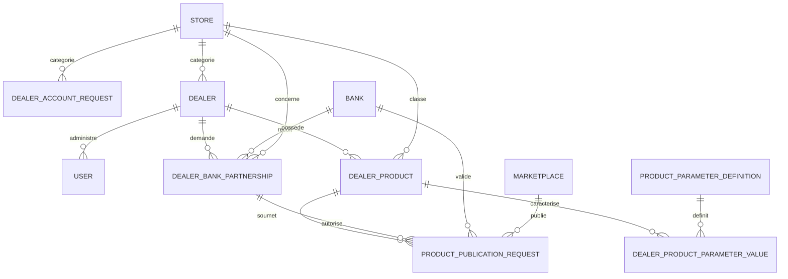

# Espace concessionnaire Matchia

## Architecture

Le domaine concessionnaire est additif. Le modele `Product` bancaire existant n'est pas modifie. Les produits multi-banques utilisent `DealerProduct`, tandis que leurs caracteristiques reutilisent les definitions `ProductParameterDefinition` du store.

Relations principales:

## API

### Publique

- `POST /api/public/dealers/requests`: demande multipart avec JSON, logo et justificatifs.
- `GET /api/public/dealers/marketplaces/{bankSlug}/stores/{storeId}/products`: produits actifs et approuves du marketplace.

### SaaS

- `GET /api/saas/dealers/requests`: pagination, tri et filtres `status`, `search`, `storeId`, `from`, `to`.
- `GET /api/saas/dealers/requests/{id}/documents/{index}`: consultation securisee d'un justificatif.
- `PUT /api/saas/dealers/requests/{id}/approve`: creation du concessionnaire et de son administrateur.
- `PUT /api/saas/dealers/requests/{id}/reject`: rejet avec motif.

### Concessionnaire

- `GET /api/dealer/me`
- `GET /api/dealer/dashboard`
- `GET /api/dealer/available-banks`
- `GET|POST /api/dealer/partnerships`
- `GET|POST /api/dealer/products`
- `PUT|DELETE /api/dealer/products/{id}`
- `GET|POST /api/dealer/publications`
- `GET /api/dealer/notifications`
- `GET /api/dealer/notifications/unread-count`
- `PATCH /api/dealer/notifications/{id}/read`
- `PATCH /api/dealer/notifications/read-all`
- `DELETE /api/dealer/notifications/{id}`

### Banque

- `GET /api/bank/dealers/partnerships`
- `PUT /api/bank/dealers/partnerships/{id}/{status}`
- `GET /api/bank/dealers/publications`
- `PUT /api/bank/dealers/publications/{id}/{status}`

## Permissions

| Action | Public | ADMIN_SAAS | ADMIN_BANK | DEALER_ADMIN |
|---|---:|---:|---:|---:|
| Deposer une demande | Oui | Oui | Oui | Oui |
| Traiter les demandes de compte | Non | Oui | Non | Non |
| Gerer partenariats et produits du concessionnaire | Non | Non | Non | Propre compte uniquement |
| Traiter un partenariat/publication | Non | Oui | Banque courante uniquement | Non |
| Lire les produits marketplace | Oui | Oui | Oui | Oui |

Les controles d'appartenance sont executes dans les services backend. Une modification du frontend ne permet pas de contourner l'isolation.

## Workflow

1. Le concessionnaire depose un dossier `PENDING` avec logo et justificatifs.
2. Le SaaS approuve ou rejette. L'approbation cree un `Dealer` actif et un `User` `DEALER_ADMIN` avec mot de passe temporaire hache.
3. Le concessionnaire demande un partenariat pour sa categorie et un store actif d'une banque.
4. La banque approuve, rejette, suspend ou termine le partenariat.
5. Avec un partenariat approuve, le concessionnaire soumet un produit actif.
6. Chaque banque decide independamment de la publication.
7. Le marketplace retourne uniquement les publications actives et approuvees dont le partenariat, le concessionnaire, le produit, le store et le marketplace sont actifs.

Chaque transition importante produit une notification, un email via le template Matchia existant et/ou une entree dans le journal d'audit.

## Migration et fichiers

Le script PostgreSQL est `MatchiaBackend/src/main/resources/db/migration/V20260806__dealer_management.sql`. Il est additif et doit etre applique avant de desactiver `spring.jpa.hibernate.ddl-auto=update` en production.

Repertoires configurables:

- `app.dealer.upload.dir`, defaut `uploads/dealers`.
- `app.dealer.product.upload.dir`, defaut `uploads/dealer-products`.

Les logos sont publics pour l'affichage. Les justificatifs sont servis uniquement par l'endpoint SaaS authentifie. Les mots de passe temporaires ne sont jamais persistes en clair.

## Verification

- `mvnw.cmd -Dtest=DealerPartnershipServiceTest test`
- `mvnw.cmd test`
- `npm run build`

Les tests ciblent notamment le refus des doublons de partenariat et l'interdiction de traitement inter-banques. Les scenarios manuels doivent couvrir l'inscription multipart, l'approbation/rejet, la publication multi-banques, la suspension et la disparition immediate du produit du marketplace.
